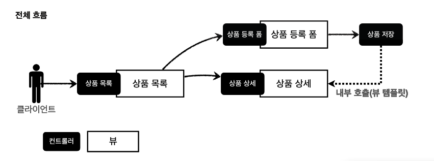
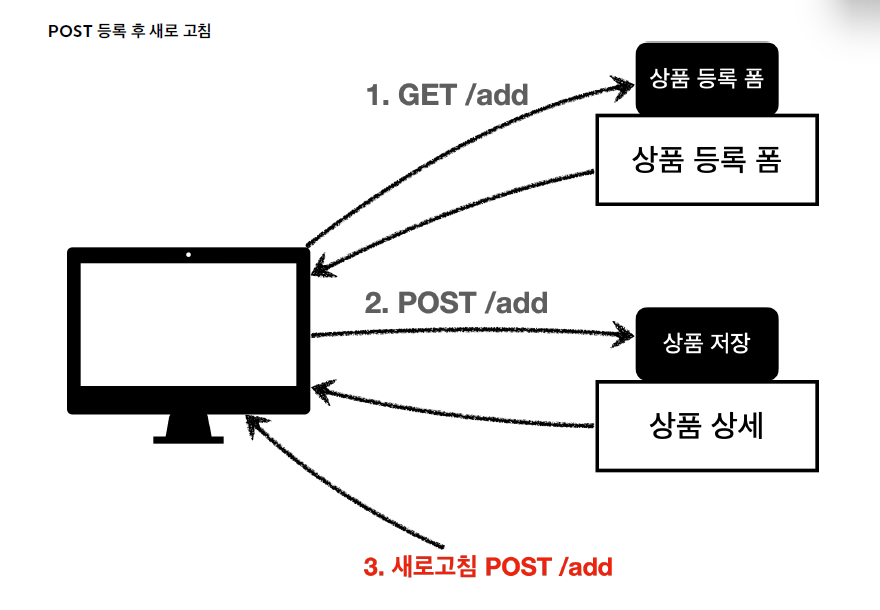
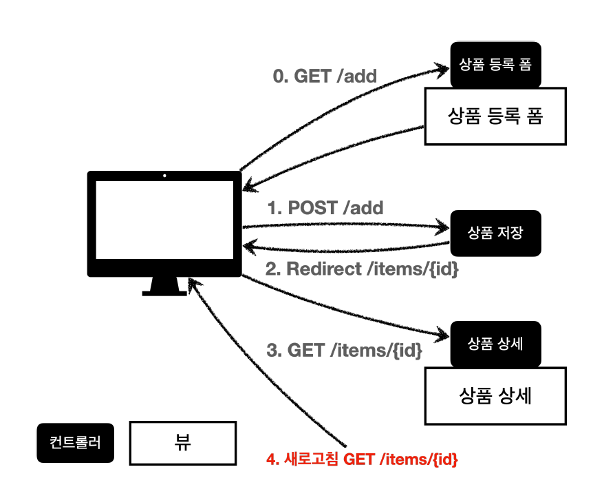

# PRG (Post - Redirect - Get) 패턴

앞서 만든 상품 등록 컨트롤러를 다시 살펴보자.

사실 이 컨트롤러에는 사용자가 의도하지 않은 중복 등록 문제가 존재한다.

---

## 상품 등록 컨트롤러의 문제점

상품 등록을 완료한 뒤 상품 상세 화면에서 웹 브라우저의 **새로고침(F5)** 을 눌러보자.

상품이 계속 중복 등록되는 것을 확인할 수 있다.

흐름을 살펴보면 다음과 같다.





- 사용자가 상품 등록 폼에 데이터를 입력한 뒤 저장 버튼을 클릭한다.
- 브라우저는 서버에 `POST /add + 상품 데이터` 요청을 전송한다.
- 서버는 상품을 저장한 후 상품 상세 화면을 응답한다.
- 이 시점에서 브라우저가 기억하고 있는 마지막 요청은 `POST /add` 이다.

따라서 사용자가 새로고침을 하면 브라우저는 마지막 요청인 `POST /add` 를 다시 전송하려고 시도한다.

이 때문에 동일한 상품이 다시 저장되는 문제가 발생한다.

실제로 브라우저는 다음과 같은 경고를 표시하기도 한다.

> 이 페이지를 새로 고치려면 이전에 제출한 정보를 다시 전송해야 합니다.

사용자가 계속 진행을 선택하면 동일한 POST 요청이 다시 전송된다.

---

## PRG 패턴을 통한 문제 해결

이 문제를 해결하기 위해 사용하는 패턴이 바로 **PRG(Post - Redirect - Get)** 패턴이다.

PRG는 다음 순서로 동작한다.

```text
POST 요청
→ Redirect 응답
→ GET 요청
```

다음 그림을 보자.



문제의 원인은 상품 등록 후 브라우저의 마지막 요청이 `POST /add` 로 남아 있다는 점이다.

따라서 상품 등록이 완료된 후 브라우저가 새로운 GET 요청을 보내도록 만들면 된다.

컨트롤러를 다음과 같이 수정하자.

```java
@PostMapping("/add")
public String save(@ModelAttribute Item item) {
    itemRepository.save(item);

    return "redirect:/basic/items/" + item.getId();
}
```

상품 저장이 완료되면 서버는 상품 상세 페이지를 직접 반환하지 않고 Redirect 응답을 반환한다.

그러면 브라우저는 다음과 같이 동작한다.

```text
POST /add
↓
상품 저장
↓
302 Redirect
↓
GET /basic/items/{id}
↓
상품 상세 페이지 조회
```

결과적으로 브라우저의 마지막 요청은 더 이상 `POST /add` 가 아니라 `GET /basic/items/{id}` 가 된다.

따라서 사용자가 새로고침을 하더라도 상품 등록 요청이 다시 전송되지 않고, 단순히 상품 상세 조회 요청만 다시 수행된다.

---

## 🚨 `redirectAttribute` 사용하기

```java
@PostMapping("/add")
public String save(@ModelAttribute Item item) {
    itemRepository.save(item);

    return "redirect:/basic/items/" + item.getId();
}
```
위 코드를 보면, 리다이렉트할 URL을 만들기 위해 `item.getId()`를 문자열에 직접 이어 붙이고 있다.

현재 상황에서는 이 방법으로도 충분하지만, 리다이렉트 과정에서 **경로 변수(Path Variable)** 나 **쿼리 파라미터(Query Parameter)** 를 함께 전달해야 하는 경우에는 코드가 복잡해질 수 있다.

이러한 경우를 위해, 스프링에서는 **`RedirectAttributes`** 를 제공한다.

---

### 1) `RedirectAttributes`란?

`RedirectAttributes`는 **리다이렉트 과정에서 전달할 데이터를 담기 위한 객체**이다.

`RedirectAttributes`는 크게 다음 두 가지 메서드로 데이터를 전달할 수 있다.

- `addAttribute()`
- `addFlashAttribute()`

---

### 2) `addAttribute()` 메서드 사용법

먼저, `addAttribute()`로 추가된 데이터는 리다이렉트 과정에서 다음과 같이 사용된다.

- 컨트롤러의 리다이렉트 URL의 **경로 변수(Path Variable)** 를 치환한다.
- URL에서 사용되지 않은 값은 **쿼리 파라미터(Query Parameter)** 로 자동 추가된다.

따라서 문자열을 직접 조합하지 않고도 리다이렉트 URL을 쉽고 안전하게 만들 수 있다.

```java
@PostMapping("/add")
public String save(@ModelAttribute Item item,
                   RedirectAttributes redirectAttributes) {

    itemRepository.save(item);

    redirectAttributes.addAttribute("itemId", item.getId());
    redirectAttributes.addAttribute("status", true);

    return "redirect:/basic/items/{itemId}";
}
```

#### 실행 과정

상품 저장 후 `item.getId()`가 `3`이라고 가정해보자.

먼저,

```java
redirectAttributes.addAttribute("itemId", 3);
```

를 통해 `itemId`라는 이름의 값을 리다이렉트 URL 생성에 사용할 속성으로 등록한다.

이후

```java
return "redirect:/basic/items/{itemId}";
```

를 반환하면 스프링이 `{itemId}`를 `3`으로 치환한다.

또한 URL에서 사용되지 않은

```java
redirectAttributes.addAttribute("status", true);
```

는 자동으로 쿼리 파라미터가 된다.

최종적으로 다음 URL로 리다이렉트된다.

```text
/basic/items/3?status=true
```

---

#### 뷰 페이지에서 사용하기

`addAttribute()`로 전달한 값은 **리다이렉트 URL에서 어떻게 사용되었는지에 따라 뷰에서 접근하는 방법이 달라진다.**

#### a. 경로 변수(Path Variable)

`itemId`는 URL의 경로에 사용되었다.

```text
/basic/items/3
```

여기서 `3`은 **경로 변수(Path Variable)** 이므로 요청 파라미터가 아니다.

따라서 Thymeleaf에서 다음과 같이 사용할 수 없다.

```html
<span th:text="${param.itemId}"></span>
```

`${param}`은 **쿼리 파라미터와 폼 파라미터만 조회**하기 때문이다.

---

#### b. 쿼리 파라미터(Query Parameter)

`status`는 URL에서 사용되지 않았기 때문에 자동으로 쿼리 파라미터가 된다.

```text
/basic/items/3?status=true
```

이 값은 Thymeleaf에서 `${param}`으로 조회할 수 있다.

```html
<div class="alert alert-success"
     th:if="${param.status}">
    상품이 정상적으로 등록되었습니다.
</div>
```

이처럼 등록 완료, 수정 완료 등의 **일회성 성공 메시지**를 표시할 때 자주 사용한다.

---

### 3) `addFlashAttribute()` 메서드 사용법

`addFlashAttribute()`는 **리다이렉트 이후 다음 요청에서 한 번만 사용할 데이터를 전달할 때 사용한다.**

`addAttribute()`와 달리 `addFlashAttribute()`로 전달한 값은 URL에 노출되지 않는다.

```java
@PostMapping("/add")
public String save(@ModelAttribute Item item,
                   RedirectAttributes redirectAttributes) {

    itemRepository.save(item);

    redirectAttributes.addAttribute("itemId", item.getId());
    redirectAttributes.addFlashAttribute("message", "상품이 정상적으로 등록되었습니다.");

    return "redirect:/basic/items/{itemId}";
}
```

최종 URL은 다음과 같다.

```text
/basic/items/3
```

`message` 값은 리다이렉트 URL에 붙지 않는다.

대신 이 데이터는 리다이렉트 과정에서 FlashMap에 임시로 저장된다.

그리고 리다이렉트 이후 실행되는 GET 요청에서 Model에 담겨 뷰 페이지로 전달되므로,
다른 Model 데이터처럼 뷰 페이지에서 꺼내 사용할 수 있다.

단, Flash Attribute는 다음 요청에서 한 번만 사용할 수 있는 일회성 데이터이다.

```html
<div class="alert alert-success"
     th:text="${message}">
</div>
```

즉, `addFlashAttribute()`는 `addAttribute()`와 비슷하지만

리다이렉트 데이터를 URL의 경로변수나 쿼리스트링 형태가 아닌 model 에 담아 일회성으로 전달할때 사용된다. 

---

## PRG 정리

- 상품 등록과 같이 서버의 상태를 변경하는 요청은 새로고침 시 중복 실행 문제가 발생할 수 있다.
- 이를 방지하기 위해 POST 요청 처리 후 화면을 직접 반환하지 않고 Redirect를 통해 새로운 GET 요청을 유도한다.
- 이러한 패턴을 **PRG(Post - Redirect - Get)** 패턴이라고 하며, 웹 애플리케이션에서 매우 널리 사용되는 방식이다.
- 특히 SSR 기반 웹 애플리케이션에서는 상품 등록, 회원 가입, 게시글 작성, 댓글 작성과 같은 상태 변경 작업에서 PRG 패턴을 기본적으로 사용한다.

---

